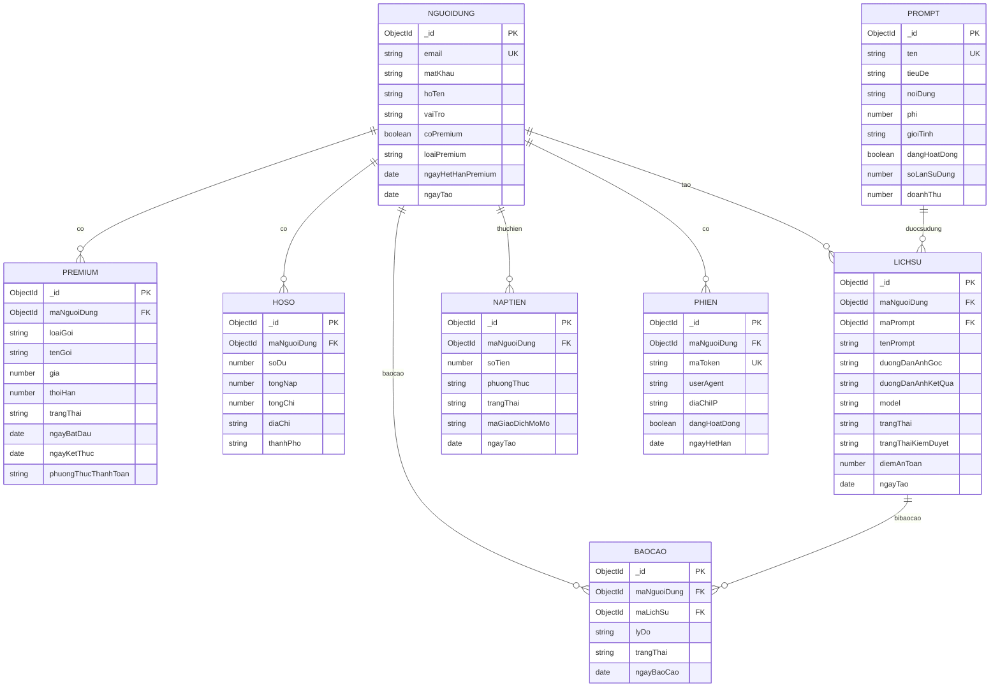

# SƠ ĐỒ HỆ THỐNG - MERMAID DIAGRAMS

> **Lưu ý**: Các sơ đồ dưới đây sử dụng cú pháp Mermaid. Bạn có thể:
> - Xem trực tiếp trên GitHub (tự động render)
> - Sử dụng VS Code extension "Markdown Preview Mermaid Support"
> - Copy code vào https://mermaid.live để xem và export hình ảnh

---

## 1. KIẾN TRÚC TỔNG QUAN (System Architecture)


---

## 2. LUỒNG TẠO ẢNH AI (AI Image Generation Flow)


---

## 3. LUỒNG THANH TOÁN MOMO (MoMo Payment Flow)


---

## 4. KIẾN TRÚC DATABASE (Database Schema)



---

## 5. LUỒNG XÁC THỰC (Auth Flow)


---

## 6. KIẾN TRÚC BẢO MẬT (Security Layers)


---

## 7. DEPLOYMENT ARCHITECTURE


---

## 8. USER JOURNEY MAP


---

## Hướng dẫn sử dụng:

### Cách 1: Xem trên GitHub
- Push file này lên GitHub
- GitHub tự động render Mermaid diagrams

### Cách 2: VS Code
- Cài extension "Markdown Preview Mermaid Support"
- Mở file và nhấn Ctrl+Shift+V để preview

### Cách 3: Online Editor
- Truy cập https://mermaid.live
- Copy code Mermaid vào
- Export thành PNG/SVG

### Cách 4: CLI Tool
```bash
npm install -g @mermaid-js/mermaid-cli
mmdc -i DIAGRAMS.md -o diagrams.png
```

---

**Phiên bản**: 1.0  
**Ngày tạo**: 04/12/2024
